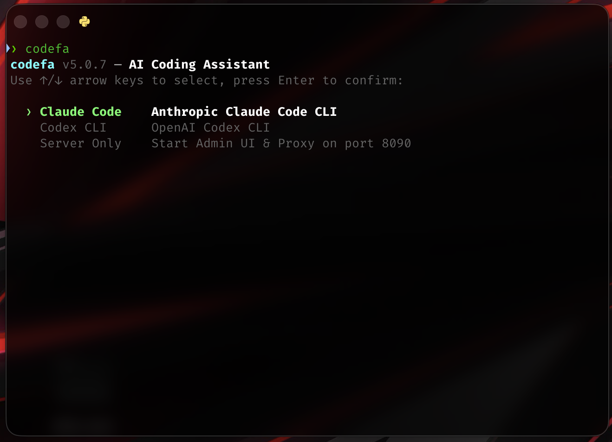
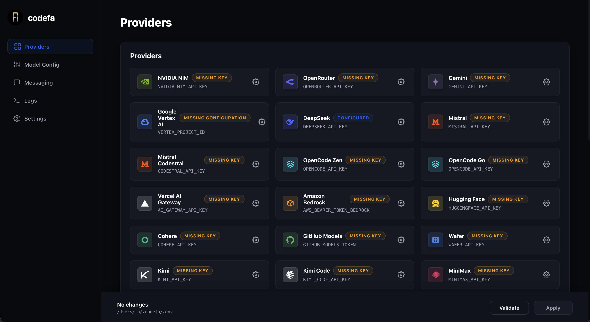
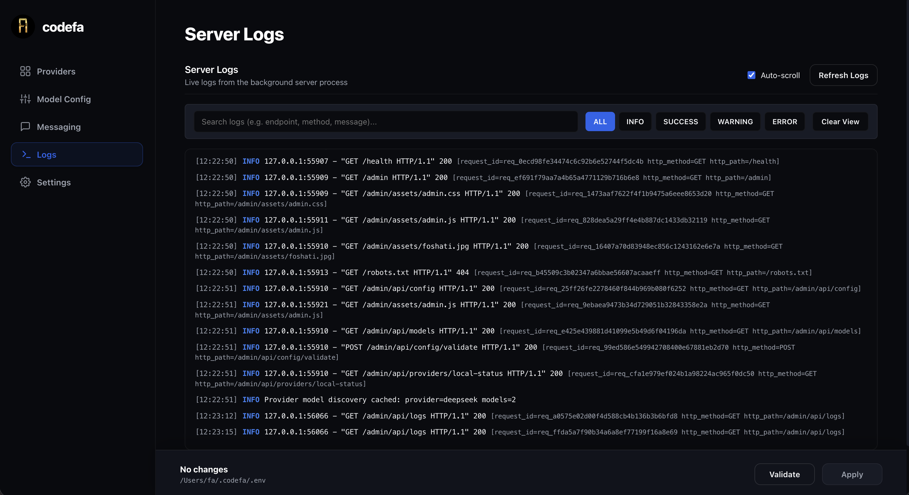
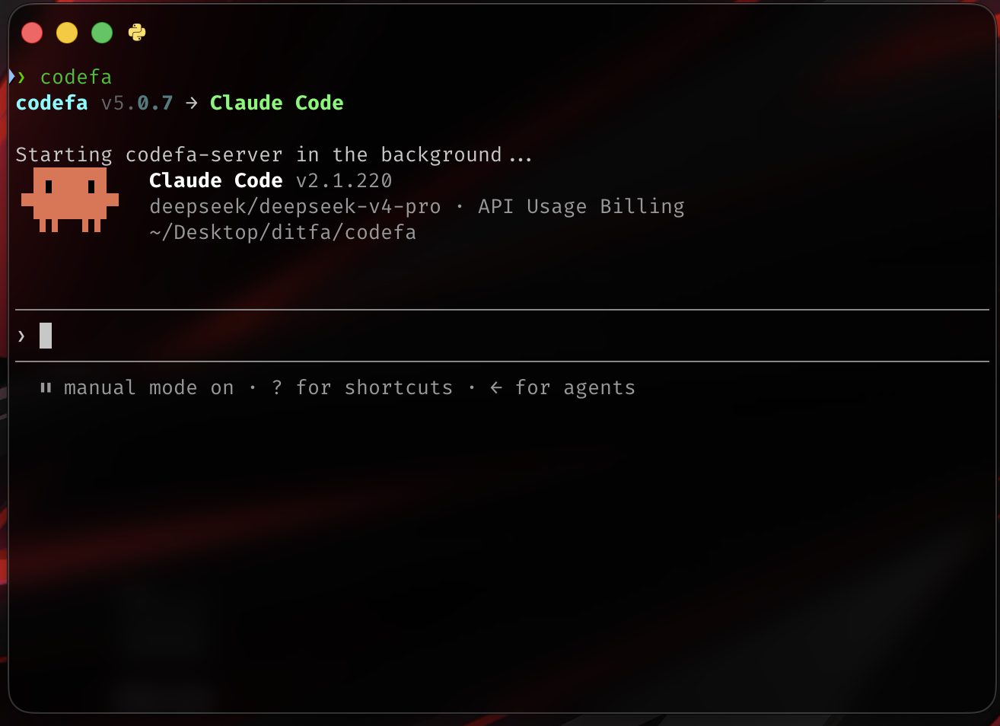
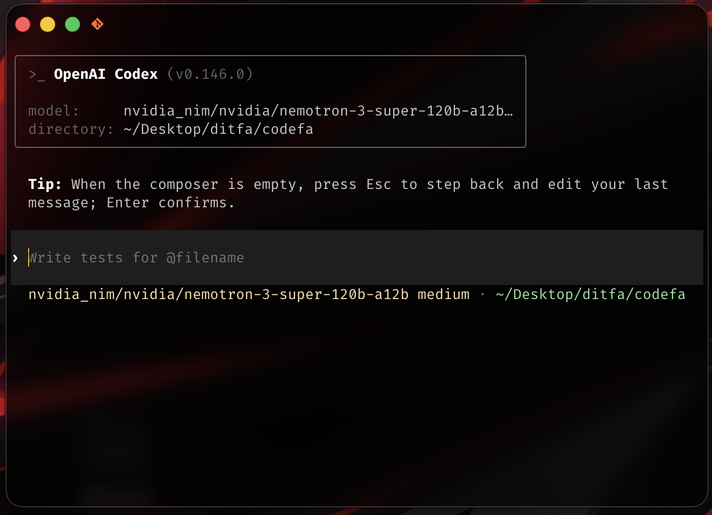
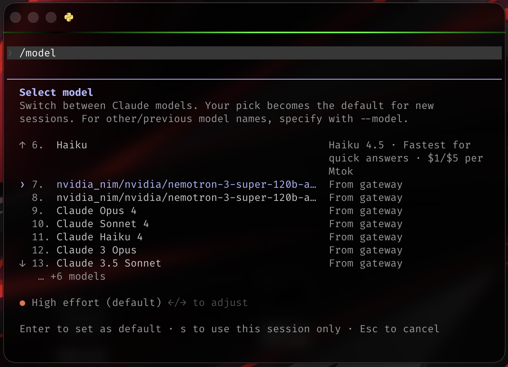

<div align="center">
  
  <h1>codefa</h1>
  <p><strong>The High-Performance Local AI Proxy & Control Center for Coding Agents</strong></p>

  <p>
    <a href="pyproject.toml"></a>
    <a href="https://python.org"></a>
    <a href="LICENSE"></a>
  </p>
</div>

---

## 🚀 Overview

**`codefa`** is an ultra-fast, local-first proxy and management suite designed to connect autonomous AI coding agents—such as **Claude Code** and **OpenAI Codex**—to any OpenAI-compatible AI provider (NVIDIA NIM, DeepSeek, OpenRouter, Mistral, Ollama, LM Studio, Kimi, MiniMax, and more).

Featuring an interactive terminal launcher, a modern responsive Admin UI on port `8090`, and live HTTP access log streaming, `codefa` gives you total control over model routing, provider API keys, and server diagnostics.

<div align="center">
  
  <p><em>Interactive borderless CLI selection menu in terminal</em></p>
</div>

---

## ✨ Features

- ⚡ **Interactive Terminal Launcher (`codefa`)**: Arrow-key navigation (↑/↓) to seamlessly launch **Claude Code**, **Codex CLI**, or **Server Only**.
- 🛠️ **Responsive Admin Control Panel**: Beautiful glassmorphism Web UI running on `http://127.0.0.1:8090/admin` with full Dark & Light mode support.
- 📜 **Live Server Logs Stream**: Complete real-time capture of Uvicorn HTTP access logs, API payloads, and internal routing events.
- 🤖 **Universal Coding Agent Compatibility**: Pre-configured support for both Anthropic Claude Code and OpenAI Codex CLI.
- 🔒 **100% Local & Secure**: API keys remain strictly stored in your local `~/.codefa/.env` file with zero telemetry leakage.
- 🏎️ **Optimized Performance**: Built on Python 3.14, FastAPI, Loguru, and uvloop for minimal resource overhead.

---

## 📦 Installation

### 1. Install Or Update

#### macOS / Linux
```bash
curl -fsSL https://codefa.foshati.com/install.sh | bash
```

#### Windows PowerShell
```powershell
irm https://codefa.foshati.com/install.ps1 | iex
```

### 2. Start The Server

```bash
codefa server
```

---

## ⚡ Quick Start

### 1. Launching `codefa`

Run `codefa` in your terminal to open the interactive selection menu:

```bash
codefa
```

Use the **↑** and **↓** arrow keys to highlight your choice, then press **Enter**:

- **Claude Code**: Launches Anthropic Claude Code CLI configured with `codefa` proxy.
- **Codex CLI**: Launches OpenAI Codex CLI configured with `codefa` proxy.
- **Server Only**: Starts the background proxy server and opens the Admin UI on port `8090`.

### Direct Subcommands

You can also bypass the menu and launch directly:

```bash
codefa claude   # Direct launcher for Claude Code
codefa codex    # Direct launcher for Codex CLI
codefa server   # Start server & open Admin UI
codefa-init     # Initialize ~/.codefa/.env config
```

---

## ## Choose A Provider

| Provider | Description | Example Model |
| --- | --- | --- |
| [NVIDIA NIM](https://build.nvidia.com) | Accelerated NIM microservices | `nvidia_nim/meta/llama-3.3-70b-instruct` |
| [OpenRouter](https://openrouter.ai) | Unified multi-provider gateway | `open_router/auto` |
| [Gemini](https://ai.google.dev) | Google Gemini API | `gemini/gemini-2.5-flash` |
| [Vertex AI](https://cloud.google.com/vertex-ai) | Google Cloud Vertex AI | `vertex/gemini-2.5-flash` |
| [DeepSeek](https://deepseek.com) | DeepSeek V3 & R1 models | `deepseek/deepseek-chat` |
| [Mistral](https://mistral.ai) | Mistral AI API endpoints | `mistral/mistral-large-latest` |
| [Mistral Codestral](https://mistral.ai) | Codestral IDE endpoint | `mistral_codestral/codestral-latest` |
| [OpenCode Zen](https://opencode.ai) | OpenCode Zen API | `opencode/claude-3-5-sonnet` |
| [OpenCode Go](https://opencode.ai) | OpenCode Go API | `opencode_go/claude-3-5-sonnet` |
| [Vercel AI Gateway](https://vercel.com/docs/ai-gateway) | Vercel AI Gateway | `vercel/openai/gpt-4o` |
| [Amazon Bedrock](https://aws.amazon.com/bedrock/) | Amazon Bedrock Mantle | `bedrock/anthropic.claude-3-5-sonnet-20241022-v2:0` |
| [Hugging Face](https://huggingface.co) | Hugging Face Router | `huggingface/meta-llama/Llama-3.3-70B-Instruct` |
| [Cohere](https://cohere.com) | Cohere API | `cohere/command-r-plus` |
| [GitHub Models](https://github.com/marketplace/models) | GitHub Models endpoint | `github_models/gpt-4o` |
| [Wafer](https://www.wafer.ai) | Wafer AI Pass | `wafer/claude-3-5-sonnet` |
| [Kimi](https://moonshot.cn) | Moonshot Kimi API | `kimi/moonshot-v1-8k` |
| [Kimi Code](https://kimi.com) | Kimi Code Subscription | `kimi_code/kimi-k1.5` |
| [MiniMax](https://minimax.io) | MiniMax AI API | `minimax/MiniMax-Text-01` |
| [Cerebras](https://cerebras.ai) | Cerebras Inference Engine | `cerebras/llama3.1-70b` |
| [Groq](https://groq.com) | Groq LPU Inference | `groq/llama-3.3-70b-versatile` |
| [SambaNova](https://sambanova.ai) | SambaNova Cloud | `sambanova/Meta-Llama-3.3-70B-Instruct` |
| [Fireworks](https://fireworks.ai) | Fireworks AI | `fireworks/accounts/fireworks/models/llama-v3p3-70b-instruct` |
| [Cloudflare](https://workers.cloudflare.com) | Workers AI catalog | `cloudflare/@cf/meta/llama-3.3-70b-instruct` |
| [Z.ai](https://z.ai) | Z.ai GLM Coding Plan | `zai/glm-4` |
| [Ollama Cloud](https://ollama.com) | Ollama Cloud remote | `ollama_cloud/llama3.3` |
| [LM Studio](https://lmstudio.ai) | Local LM Studio server | `lmstudio/local-model` |
| [llama.cpp](https://github.com/ggerganov/llama.cpp) | Local llama.cpp server | `llamacpp/local-model` |
| [Ollama](https://ollama.com) | Local Ollama instance | `ollama/llama3.3:latest` |

---

## 🎨 Admin UI & Control Center

Access the Admin UI anytime at **[http://127.0.0.1:8090/admin](http://127.0.0.1:8090/admin)**.

### Providers Configuration

Configure API keys, model choices, rate limits, and proxies for all supported AI providers in a responsive, theme-aware Web UI:

<div align="center">
  
</div>

### Live Server Logs

Monitor live HTTP requests, status codes, and routing events in real time:

<div align="center">
  
</div>

---

## 🤖 Coding Agents Integration

### Claude Code

`codefa` automatically injects proxy environment variables for seamless integration with Anthropic Claude Code:

<div align="center">
  
</div>

### OpenAI Codex CLI

Run Codex CLI with custom models and local provider routing:

<div align="center">
  
</div>

<div align="center">
  
</div>

---

## 🏗️ Architecture & Workflow

`codefa` acts as a local bridge between client protocol requests (Anthropic Messages API & OpenAI Responses API) and downstream AI provider endpoints:

<div align="center">
  
</div>

---

## 🗑️ Uninstallation

To uninstall `codefa`:

#### macOS / Linux
```bash
curl -fsSL "https://raw.githubusercontent.com/Foshati/codefa/main/scripts/uninstall.sh" | sh
```

#### Windows PowerShell
```powershell
& ([scriptblock]::Create((irm "https://raw.githubusercontent.com/Foshati/codefa/main/scripts/uninstall.ps1")))
```

This verifies every CODEFA command is gone.

---

## 📄 License

Distributed under the **MIT License**. See `LICENSE` for more information.

<div align="center">
  <p>Created with ❤️ by <a href="https://github.com/Foshati">Foshati</a></p>
</div>
